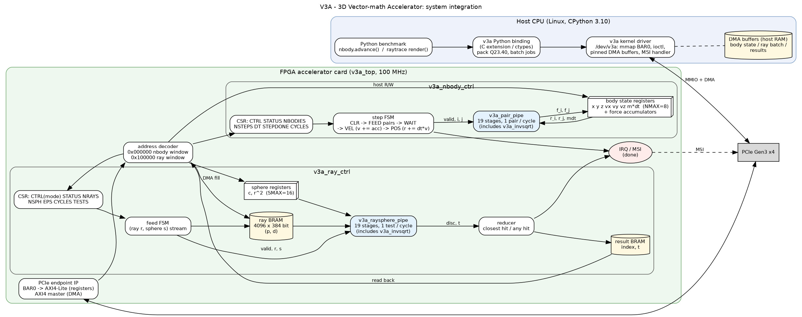
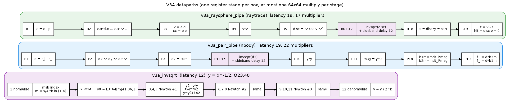

# V3A — 3D Vector-math Accelerator

One hardware accelerator for both benchmarks. The hot math of **nbody**
(pair distance, |d|^-3) and **raytrace** (ray–sphere test) is the same:
3D subtract, dot product, inverse square root. V3A implements it once as
pipelined Verilog IP and exposes two kernels behind one PCIe register map.




## Files

```
rtl/v3a_top.v              register bus decode (PCIe BAR0 / AXI4-Lite), IRQ
rtl/v3a_nbody_ctrl.v       nbody kernel: body registers + step FSM + integrator
rtl/v3a_pair_pipe.v        pairwise-gravity datapath, 19 stages, 1 pair/cycle
rtl/v3a_ray_ctrl.v         ray kernel: ray BRAM, feed FSM, reducer, result BRAM
rtl/v3a_raysphere_pipe.v   ray-sphere datapath, 19 stages, 1 test/cycle
rtl/v3a_invsqrt.v          shared 1/sqrt(x) IP, 12 stages (ROM + 3 Newton iterations)
rtl/v3a_delay.v            sideband pipeline balancing
rtl/v3a_common.vh          Q23.40 fixed-point multiply
rtl/v3a_invsqrt_lut.vh     initial-guess ROM (generated by model/v3a_model.py)
model/v3a_model.py         bit-accurate golden model (defines the exact arithmetic)
model/raytrace_offload_share.py  measures the fraction of a frame spent in sphere tests
tb/tb_v3a.v                system testbench (acts as the host driver)
run_hw_tests.py            generate vectors from the real benchmarks, simulate, check
docs/*.dot|svg|png         block diagrams (graphviz sources included)
sim/results.txt            latest verification results
```

## Run

```bash
sudo apt install -y iverilog graphviz
python3 hw/run_hw_tests.py                 # ~20 s: nbody 2000 steps, 2500 primary + shadow rays
python3 hw/model/raytrace_offload_share.py # Amdahl input for the raytrace estimate
dot -Tpng hw/docs/v3a_system.dot -o hw/docs/v3a_system.png   # regenerate diagrams
```

Both `script_nbody.sh` and `script_raytrace.sh` also run the hardware simulation (step 8).

## Key numbers (RTL simulation, 100 MHz assumption)

| | result |
|---|---|
| RTL vs golden model | bit-exact (nbody state, closest hit, any hit) |
| nbody | 38 cycles per step (5 bodies) → 7.6 ms per benchmark loop vs 139 ms optimized CPython (~18x) |
| nbody accuracy | energy within 1.3e-9 (relative) of the double-precision benchmark after 2000 steps |
| raytrace | 1 ray–sphere test per cycle; 179,457 tests/frame ≈ 1.8 ms |
| raytrace system gain | ~1.6–1.8x over optimized software (Amdahl limit 1.9x: sphere tests are 48% of a frame) |
| raytrace accuracy | closest sphere and shadow decisions identical to the float benchmark on all tested rays |
